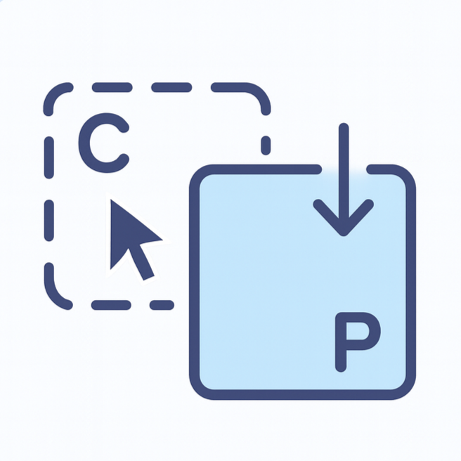

<div align="center">
  

  # PasteMine

一款 macOS 剪贴板历史管理工具：轻量、隐私、本地化

中文文档 | [English](./README.md)

</div>

## 直接安装【macOS 安全提示说明】

本应用**未经过 Apple 官方签名或公证**，  
首次打开时，macOS 可能会阻止运行，这是系统的正常安全机制。

你可以通过以下 **任意一种方式** 允许运行。

---

**方法一：通过系统设置允许运行（推荐）**

1. 打开 `.dmg` 文件，将应用拖入 **应用程序（Applications）**
2. 尝试打开一次应用后，点击 **取消**
3. 打开 **系统设置 → 隐私与安全性**
4. 滚动到页面底部
5. 点击 **仍要打开**
6. 在弹窗中确认 **打开**

完成后，应用即可正常运行。

---

**方法二：通过右键方式打开**

1. 打开 **应用程序（Applications）**
2. 右键（或按住 Control 键点击）应用图标
3. 选择 **打开**
4. 在弹出的确认窗口中点击 **打开**

## 功能特性

**仅支持文字和图片**

- **剪贴板历史**: 自动记录剪贴板历史，支持文本、图片和文件
- **快速访问**: 使用可自定义的快捷键即时访问剪贴板历史
- **智能粘贴**: 通过辅助功能权限自动粘贴选中的内容
- **隐私保护**:
  - 所有数据仅存储在本地，绝不上传
  - 自动忽略敏感应用（密码管理器、银行应用等）
  - 过滤特定剪贴板类型
  - 随时清空历史记录
- **音效反馈**: 可选的复制/粘贴音效提示
- **开机启动**: 系统启动时自动运行
- **现代界面**: 基于 SwiftUI 构建的简洁原生 macOS 界面

## 系统要求

- macOS 14.0 或更高版本
- Xcode 15.0 或更高版本（从源码构建时需要）

## 安装

### 下载

从 [Releases](https://github.com/lemonsstyle/PasteMine_App_Store/releases) 页面下载最新版本。

### 从源码构建

1. 克隆仓库：
```bash
git clone https://github.com/lemonsstyle/PasteMine_App_Store.git
cd PasteMine_Compliance
```

2. 使用 Xcode 打开项目：
```bash
open PasteMine/PasteMine.xcodeproj
```

3. 配置开发团队：
   - 在 Xcode 中选择 PasteMine 项目
   - 进入 "Signing & Capabilities"
   - 设置你的 Development Team ID
   - 修改 Bundle Identifier

4. 构建并运行 (⌘R)

## 使用说明

### 首次启动

首次启动时，PasteMine 会引导你完成设置流程：

1. **剪贴板监控**: 启用剪贴板历史记录功能
2. **通知权限**: 允许复制/粘贴操作的通知提醒
3. **辅助功能**: 授予辅助功能权限以使用自动粘贴功能

### 快捷键

- **⌃⌥V**: 打开剪贴板历史窗口（可自定义）
- **↑/↓**: 在历史记录中导航
- **回车**: 粘贴选中的内容
- **⌘D**: 删除选中的记录
- **⌘K**: 清空所有历史
- **ESC**: 关闭窗口

### 设置

点击历史窗口中的齿轮图标访问设置：

- **通用**: 配置快捷键和开机启动
- **隐私**: 管理忽略的应用和剪贴板类型
- **音效**: 启用/禁用音效反馈
- **关于**: 查看应用信息和版本

## 项目结构

```
PasteMine/
├── PasteMine/
│   ├── PasteMine.xcodeproj/      # Xcode 项目文件
│   ├── PasteMine/                # 源代码
│   │   ├── App/                  # 应用生命周期
│   │   ├── Managers/             # 功能管理器
│   │   ├── Models/               # 数据模型
│   │   ├── Services/             # 业务服务
│   │   ├── Views/                # 用户界面
│   │   ├── Utilities/            # 工具类
│   │   └── Resources/            # 资源和音效
│   └── PrivacyInfo.xcprivacy     # 隐私清单
├── Scripts/                       # 构建脚本
├── LICENSE                        # MIT 许可证
└── README.md                      # 项目说明
```

## 隐私保护

PasteMine 重视你的隐私：

- ✅ 所有数据仅存储在本地 Application Support 目录
- ✅ 无网络请求或数据传输
- ✅ 无第三方 SDK 或分析工具
- ✅ 符合 Apple 隐私清单要求
- ✅ 开源代码 - 可自行审查

## 贡献

欢迎贡献！请阅读 [CONTRIBUTING.md](./CONTRIBUTING.md) 了解详情。

## 许可证

本项目采用 MIT 许可证 - 详见 [LICENSE](./LICENSE) 文件。

## 致谢

使用 SwiftUI 和现代 macOS API 构建。

## 支持

如果遇到任何问题或有建议，请[提交 issue](https://github.com/lemonsstyle/PasteMine_App_Store/issues)。

---

用 ❤️ 制作 by [lemonstyle](https://github.com/lemonsstyle)
